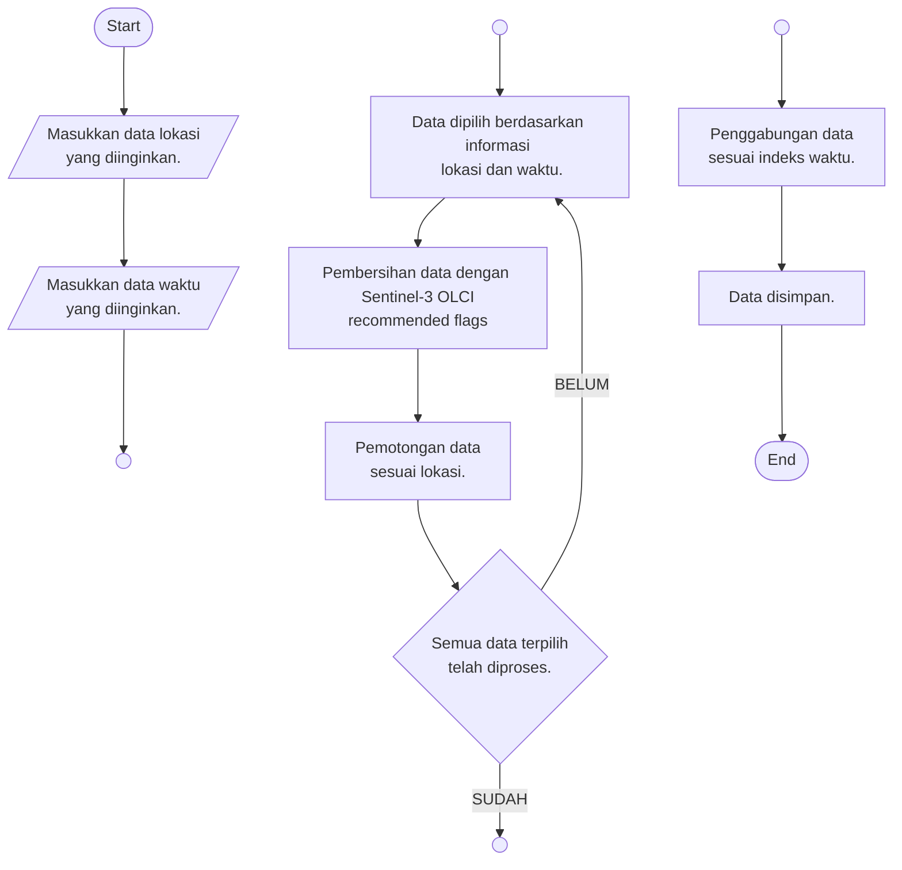

# Program Akses Parameter Biogeokimia dari Dataset Sentinel-3 OLCI

## Latar Belakang

Sentinel-3 merupakan sistem penginderaan jauh untuk pengamatan bumi (_earth observation_) yang dikelola bersama oleh *European Organisation for the Exploitation of Meterological Satellites* (EUMETSAT) dan *European Space Agency* (ESA). Berdasarkan informasi dari *website*-nya, tujuan utama dari misi satelit Sentinel-3 adalah untuk pengukuran topografi permukaan darat dan laut, temperatur permukaan bumi serta parameter optik permukaan bumi secara akurat. Produk dari Sentinel-3 dapat digunakan untuk pemantauan kondisi lingkungan dan iklim, di darat maupun di laut.

Salah satu sensor yang digunakan pada Sentinel-3 adalah *Ocean and Land Colour Instrument* (OLCI). Produk dari sensor ini berupa absorpsi optik yang bisa diturunkan untuk memperkiran kandungan klorofil-a dan material terlarut di permukaan laut, danau maupun sungai. Dataset OLCI level 2 memiliki resolusi tinggi hingga 300 m. Dengan resolusi ini, dataset OLCI bisa digunakan secara akurat termasuk untuk lingkup area yang kecil, misalnya untuk kawasan pesisir.

Data Sentinel-3 didistribusikan secara luas dan gratis oleh berbagai platform, termasuk oleh Planetary Computer milik Microsoft. Data dapat diakses dengan cara mengunduh secara langsung, menggunakan perangkat lunak kebumian seperti ArcGIS atau QGIS, serta dengan menggunakan bahasa pemrograman. Akses data dengan menggunakan bahasa pemrograman relatif lebih menguntungkan karena fitur-fitur pada dataset dapat digunakan secara optimal sesuai dengan kebutuhan. 

Dengan menggunakan bahasa Python, program ini dibuat dengan memanfaatkan fitur yang tersedia pada dataset, termasuk untuk memilih data berdasarkan lokasi dan waktu. Dengan program ini, pengguna dapat dengan mudah melakukan pengunduhan data sesuai dengan kebutuhannya, tidak perlu mengunduh data satu per satu, serta tidak perlu melakukan pemrosesan dasar seperti penerapan _flags_ dan penggabungan berbasis waktu. 

## Tujuan dan Manfaat Program

Program komputer ini dibuat untuk tujuan sebagai berikut:

1. Mempermudah proses akuisisi data satelit Sentinel-3 OLCI terutama untuk parameter optik dan turunannya, yaitu klorofil-a dan total material tersuspensi (*total suspended matter*/TSM).
2. Mendapatkan data satelit untuk parameter optik laut dengan format standar, yang dapat dianalisis menggunakan perangkat lunak yang umum di bidang kebumian dan oseanografi.

Program ini diharapkan dapat dimanfaatkan kalangan peneliti, dosen dan mahasiswa bidang kelautan yang memerlukan data satelit Sentinel-3. Dengan menggunakan program ini, pengguna bisa mendapatkan data Sentinel-3 dengan relatif mudah dan waktu akuisisi data yang lebih singkat.

## Algoritma Program



## Kebutuhan Modul Python

> [!TIP]
> Modul Python yang digunakan untuk menjalankan program tersedia pada repositori Anaconda, kecuali untuk HDA tersedia melalui pypi (pip).

|Nama modul                         | Nama modul      |
|:----------------------------------|:----------------|
| aiohttp                           | bottleneck      |
| cartopy                           | cf_xarray       |
| colormaps                         | dask            |
| h5netcdf                          | ipykernel       |
| matplotlib                        | netcdf4         |
| numpy                             | pip             |
| planetary-computer                | pystac-client   |
| requests                          | rich            |
| rioxarray                         | tqdm            |
| hda _(tersedia melalui `pip`)_    |                 |

## Penggunaan Dasar

Secara umum, penggunaan program untuk semua platform dapat dilakukan dengan langkah-langkah berikut:

1. Kunjungi repositori program di Github [`https://github.com/eds-ocean/imber-sen3`](https://github.com/eds-ocean/imber-sen3).
2. Unduh berkas yang ada pada repositori dan lakukan ekstraksi di lingkungan kerja yang diinginkan (disarankan pada sistem komputasi awan seperti JupyterHub).
3. Dengan menggunakan Terminal, masuk ke *environment* Python yang telah dibuat sesuai langkah pada @sec-kebutuhan (misalnya `sen3_env`).
4. Masuk ke direktori **Code** dengan menggunakan Terminal.
5. Jalankan program melalui terminal dengan mengetikkan perintah berikut:
  
   ```console
   $ python Mode_1_PlanetaryComputer.py 
   ```

6. Ikuti instruksi yang diberikan pada program.

> [!IMPORTANT]
> Program ini optimal untuk digunakan pada sistem komputasi awan seperti JupyterHub, Github Codespace, Google Colab dan lain-lain. Penggunaan pada komputer lokal bisa dilakukan, namun program memerlukan *resource* komputer dan *bandwidth* internet yang cukup besar.

### Menggunakan WEkEO JupyterHub

WEKEO JupyterHub merupakan layanan yang disediakan oleh Copernicus untuk keperluan analisis data. Layanan ini dapat digunakan secara gratis, cukup hanya dengan membuat akun. Lebih lanjut mengenai hal ini dapat dilihat pada [`https://help.wekeo.eu/en/articles/6337538-what-is-the-wekeo-jupyterhub`](https://help.wekeo.eu/en/articles/6337538-what-is-the-wekeo-jupyterhub).

Untuk menjalankan program menggunakan WEkEO JupyterHub, gunakan langkah berikut:

1. Masuk (*log-in*) ke akun WEkEO dan jalankan JupyterHub. Pengguna akan masuk ke perangkat Jupyter Notebook pada perambah (*browser*)
2. Buka Terminal dari Jupyter Notebook dan lakukan *clone* repositori program ini.

    ```console
    $ git clone https://github.com/eds-ocean/imber-sen3.git
    ```

3. Masuk ke direktori `imber-sen3` yang baru saja di-*clone*.

    ```console
    $ cd imber-sen3
    ```

4. Buat *python environment* menggunakan Conda (seperti pada @sec-kebutuhan). Setelah itu aktifkan environment tersebut.

    ```console
    $ conda create env -f Settings/sen3_env.yml
    $ conda activate sen3_env
    ```

5. Jalankan program

    ```console
    $ python Code/Mode_1_PlanetaryComputer.py
    ```

### Menggunakan Github Codespaces

Github Codespace merupakan perangkat komputasi awan yang disediakan oleh Github. Pengguna dapa menggunakan codespace untuk menjalankan program secara daring dan tidak perlu melakukan instalasi di komputer lokal. Penggunaan codespace ini merupakan metode yang paling direkomendasikan.

Langkah yang harus dilakukan untuk menjalankan program dengan Github Codespace:

1. Pengguna masuk (*log-in*) ke akun Github, dan selanjutnya kunjungi repositori program ini.
2. Lakukan _fork_ repositori Github program ini ke akun Github pengguna. Pengguna dapat terlebih dahulu mempelajari tentang membuat *fork* dari 
3. Masuk ke repositori hasil _fork_, dan buat codespace (lihat @fig-rekomendasicodea). Rekomendasi untuk codespace adalah 4 core, 16GB RAM, menggunakan server West Europe seperti ditampilkan pada @fig-rekomendasicodeb. 

{#fig-rekomendasicodea}

{#fig-rekomendasicodeb}

3. Jika Codespace telah berjalan, akan ditampilkan VSCode versi web pada perambah (*browser*). Buka Terminal pada VSCode Web tersebut dan aktifkan Anaconda. 

    ```console
    $ conda init
    ```
    Setelah itu, tutup Terminal dan buka Terminal baru.

4. Pada Terminal yang baru ditampilakn, buat *Python environment* menggunakan Conda (seperti pada @sec-kebutuhan). Setelah itu aktifkan *environment* tersebut.

    ```console
    $ conda create env -f Settings/sen3_env.yml
    $ conda activate sen3_env
    ```

5. Jalankan program

    ```console
    $ python Code/mode_1_planetarycomputer.py
    ```

# Ucapan Kerima Kasih

1. Anggota Kelompok Riset Biosfer Laut Terintegrasi BRIN. 

| Nama anggota          | Nama anggota                |
|:----------------------|:----------------------------| 
| Faisal Hamzah         | A'an J. Wahyudi             |
| Idha Yulia Ikhsani    | Afdal                       |
| Lestari               | Rachma Puspitasari          |
| Camellia K. Tito      | Harmesa                     |
| Hanif Budi Prayitno   | Edwards Taufiqurrahman      |
| Ita Wulandari         | Suci Lastrini               |
| M. T. Kaisupy         |                             |

2. Microsoft's Planetary Computer dan EU Copernicus Programme untuk _data access_, layanan, serta tutorial pengolahan data satelit Sentinel-3.

3. Program ini merupakan kelanjutan dari _project_ yang diinisiasi pada [IMBeR EO-WPI Workshop di Bali, Indonesia, November 2023](https://futureearth.org/2024/05/14/novel-mentoring-project-equips-the-next-generation-of-marine-monitoring-scientists/).
