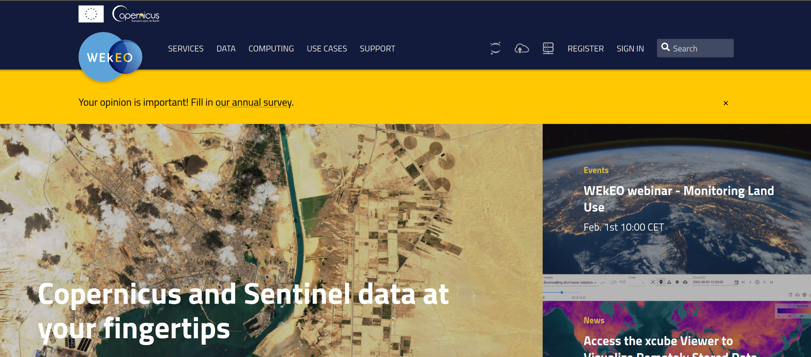
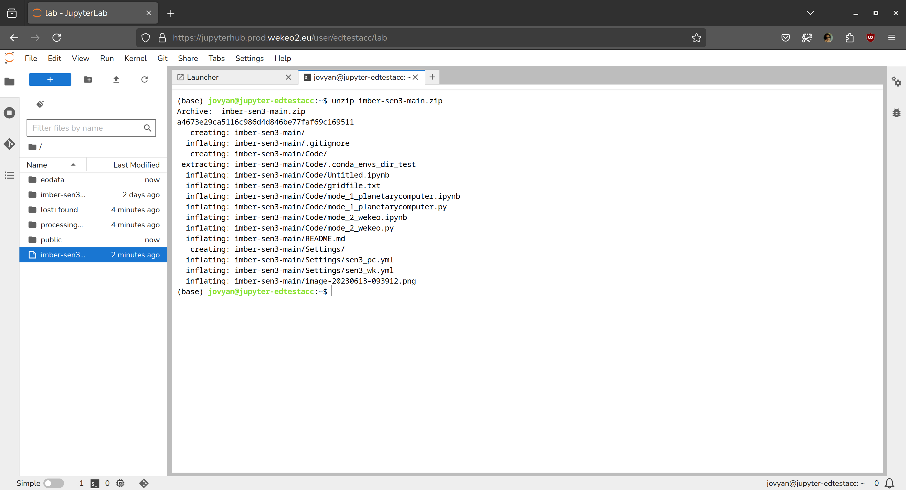
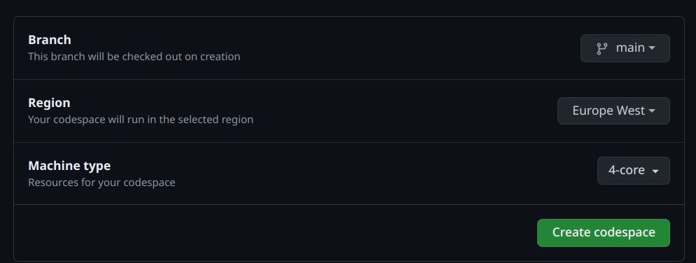

# Sentinel-3 OLCI Marine Biogeochemistry Data Acquisition Program

<details>
<summary>📝 Integrated Marine Biosphere Research Group - Research Centre for Oceanography BRIN</summary>

&nbsp;

| Member Name | Member Name | 
|:-------------|:-------------|
| Faisal Hamzah | A'an J. Wahyudi |
| Idha Yulia Ikhsani | Afdal |
| Lestari | Rachma Puspitasari |
| Harmesa | Hanif Budi Prayitno |
| 👨‍🔬 **_Edwards Taufiqurrahman_**  | Ita Wulandari |
| Suci Lastrini | M. T. Kaisupy |

</details>

## Introduction

### Sentinel-3 Data Access



### Pre-requisites

This program is intended to be used in a cloud environment e.g. JupyterHub or Github Codespaces. However, you can also run the code in your local machine.

Please make sure that your cloud or local machine can connect to global internet. For example, you cannot run it in an HPC with access only to local intranet.

In your working machine, you will need to install required modules. Conda environment's yml file is available in `Settings` directory.

## How To

### First: Copy this repo

[Download the zip file](https://github.com/eds-ocean/imber-sen3/archive/refs/heads/main.zip){:target="_blank"} of this repository and extract it in your preferred machine. If you are familiar with Github, it can be much simpler: you can just fork or clone this repo. 

The next step is to run the code in your preferred machine. We recommend using JupyterHub provided by WEkEO, or using Github Codespace. Detailed information of each method is shown below.

### Using WEkEO JupyterHub

1. Log in to your Wekeo account (please [create account here](https://www.wekeo.eu/register){:target="_blank"} if you don't have it yet).
2. Click the Jupyter logo on upper right side and choose "Jupyter Notebook"
3. Add your credential to log in.
4. Choose the server. It is recommended to choose "Earth Observation Tools". 

After successfully log in to Jupyter Notebook, you can now upload the downloaded zip file from Github.

1. In the right sidebar of Jupyter Notebook, choose "Upload"
2. Open new Terminal 
3. Type code below to unzip

    ```bash
    unzip imber-sen3-main.zip
    ```

    
4. Enter the extracted directory
   ```bash
   cd main
   ```
6. Create a new Python environment. If you want to use PlanetaryComputer, then type:
   ```bash
   conda env create -f Settings/sen3_pc.yml
   ```
   Otherwise, if you want to use WEkEO HDA, then type;
   ```bash
   conda env create -f Settings/sen3_wk.yml
   ```
7. s


### Using Github Codespace

After you're done forking this repo, you can now create codespace to run the code. Go to the forked repo, click the greed `Code` button then click Codespace. 

You might want setup the codespace first. To do so, in the Codespace tab click 3-dot (`...`) button and then choose "Manage Codespace" In the right, there is green button and click on left right side of the button (the thing with arrow), then select "Configure and create codespace". Fill the form like below.



