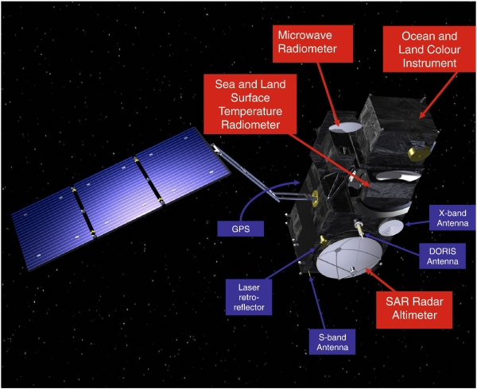

# Simplifikasi proses akuisisi data Sentinel-3 OLCI Level 2

📝 Kelompok riset IMBeR - Pusat Riset Oseanografi BRIN

Anggota:

- Edwards Taufiqurrahman
    - A'an Johan Wahyudi
    - Afdal
    - Camellia Kusuma Tito
    - Faisal Hamzah
    - Hanief Budi Prayitno
    - Harmesa
    - Idha Yulia Ikhsani
    - Ita Wulandari
    - Lestari
    - M. Taufik Kaisupy
    - Rachma Puspitasari
    - Suci Lastrini

## Pendahuluan

Sentinel-3 merupakan proyek satelit observasi bumi yang dioperasikan oleh ESA & EUMETSAT. Data Sentinel-3 tersedia dari beberapa instrumen:

1. Sea and Land Surface Temperature Radiometer (SLSTR),
2. Ocean and Land Colour Instrument (OLCI),
3. Altimetry Surface Topography Mission (STM). 

 

Data ini dapat diakses pada L1/2 (_higher resolution_) atau L3/4 (_lower resolution_).

## Modul dan List Kebutuhan
Untuk menggunakan _script_ ini, diperlukan beberapa hal berikut:

1. Lingkungan (_environment_) pengerjaan.
   
   Bahasa pemrograman yang digunakan adalah 🐍`Python`.

   Kedua script ini dimaksudkan untuk mengurangi kebutuhan bandwidth internet yang digunakan oleh komputer lokal namun juga tidak memberikan beban bagi _cloud platform_. Script yang disediakan disarankan untuk dijalankan di lingkungan _cloud_ dengan _environment_ `JupyterHub`, misalnya yang disediakan oleh WeKeo dan Copernicus.

   Script pertama menggunakan data yang ditaruh di sistem [Planetary Computer yang disediakan oleh Microsoft](https://planetarycomputer.microsoft.com/). Data ini dapat diakses secara gratis dan tidak diperlukan otentifikasi untuk menggunakannya. Sangat disarankan untuk menuliskan Planetary Computer sebagai sumber akses data.

   Script kedua menggunakan data yang disediakan oleh [WeKeo](https://www.wekeo.eu/) dan diakses dengan [_Harmonized Data Access (HDA)_](https://help.wekeo.eu/en/collections/3530725-wekeo-data-download). Untuk mengakses data dari WeKeo ini, autentikasi diperlukan. Username dan password dapat diperoleh dengan meregistrasi akun di website WeKeo.
   
2. Modul Python.
3. Lokasi dan waktu yang diperlukan.

   Area of interest dapat ditentukan dengan memasukkan koordinat bounding box dengan cara memasukkan nilai titik koordinat _west_, _east_, _north_ dan _south_ dalam format desimal.

   Rentang waktu ditentukan dengan memasukkan waktu awal dan waktu akhir, dalam format `YYYY-MM-DD`

4. Parameter yang diperlukan.

   Parameter yang tersedia untuk dataset Sentinel-3 OLCI L2 antara lain:

   | Parameter | Kode |
   | --------------------- | --------------- |
   | Chlorophyll-a (nn algorithm) | `chl_nn` |
   | Chlorophyll-a (oc algorithm) | `chl_oc` |
   | Total suspended matter | `tsm_nn` |
   | Surface reflectance | `Oa01` |
   | | |

   Tabel di atas.

## Cara Kerja
