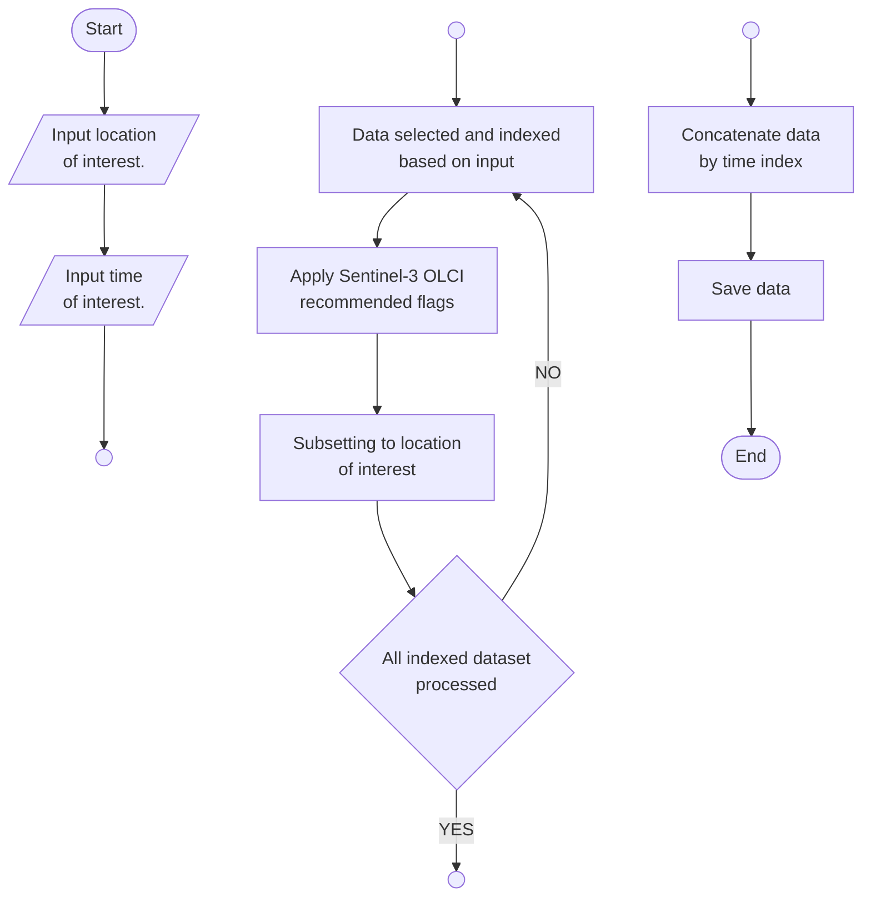
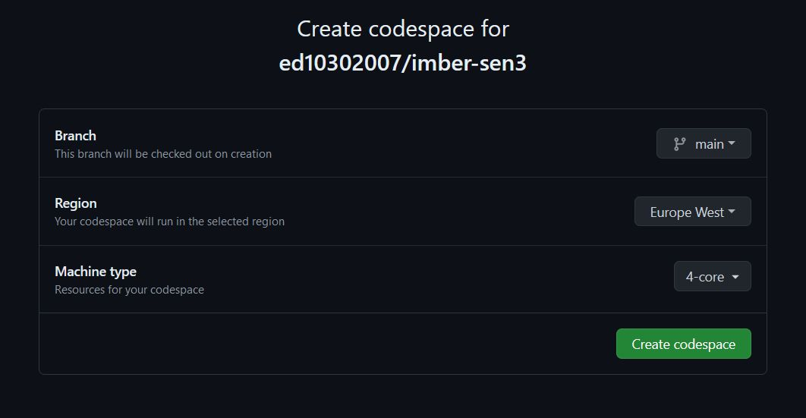

# Sentinel-3 OLCI Marine Biogeochemistry Data Acquisition Program

<details>
<summary>📝 Kelompok Riset Biosfer Laut Terintegrasi - Pusat Riset Oseanografi BRIN</summary>

&nbsp;

| Member Name | Member Name | 
|:-------------|:-------------|
| Faisal Hamzah | A'an J. Wahyudi |
| Idha Yulia Ikhsani | Afdal |
| Lestari | Rachma Puspitasari |
| Camellia K. Tito| Harmesa | 
| Hanif Budi Prayitno | ✍🏼 **_Edwards Taufiqurrahman_**  | 
| Ita Wulandari | Suci Lastrini |
| M. T. Kaisupy | |

</details>

&nbsp;

# Introduction

## Background

Sentinel-3 is a satellite system jointly operated by ESA and EUMETSAT to deliver operational ocean and land observation services. From [it's wiki](https://sentiwiki.copernicus.eu/web/s3-mission), is described as follow:

> Sentinel-3 is an European Earth Observation satellite mission developed to support Copernicus ocean, land, atmospheric, emergency, security and cryospheric applications.
> The main objective of Sentinel-3 is to measure sea surface topography, sea and land surface temperature, and ocean and land surface colour with high accuracy and reliability to support ocean forecasting systems, environmental monitoring and climate monitoring. Sentinel-3 observations also support applications based on vegetation as well as fire, inland waters (river and lake water surface height), the cryosphere (i.e., land ice and sea-ice thickness) and atmosphere.

Sentinel-3 bring multiple type of sensors:
1. SLSTR (Sea and Land Surface Temperature Radiometer) to acquire global sea surface temperature,
2. OLCI (Ocean and Land Colour Instrument) to measure optical absorptions, useful to determine chlorophyll-a and organic matters concentration,
3. SRAL (Synthetic Aperture Radar Altimeter) to measure topography profiles over ocean, rivers and lakes.
4. Other supporting sensor such as DORIS (Doppler Orbitography and Radiopositioning Integrated by Satellite), MWR (MicroWave Radiometer), LRR (Laser retroreflector), GNSS (Global Navigation Satellite System)

Sentinel-3A was launched on 16 February 2016 and Sentinel-3B was launched on 25 April 2018.

## Program Overview

This program created by combining various methods to access, subset, and combine Sentinel-3 netcdf datasets. This include using [xarray](https://xarray.dev/) to open and save `netcdf` dataset, using function provided by EUMETSAT to apply Sentinel-3 recommended flags, and using [CDO](https://code.mpimet.mpg.de/projects/cdo/wiki/Cdo%7Brbpy%7D)  to subset and regrid dataset. The flowchart of the process is shown below.



There are two version of this program: Mode 1 (PlanetaryComputer) and Mode 2 (WEkEO). Differences between these version are:

| **Parameter**         | **Mode 1 (Planetary Computer)**      | **Mode 2 (WEkEO)**                | 
|-------------------|---------------------------------|------------------------------|  
| Data source       | [Planetary Computer by Microsoft](https://planetarycomputer.microsoft.com/) | [WEkEO by ESA's Copernicus](https://www.wekeo.eu/)    |
| Access method     | STAC                            | Harmonized Data Access (HDA) |
| Processing speed  | Fast                       | Slow                         |
| Data availability | Incomplete                    | Complete                     |
| Credential required | No | Yes|


As the user, you can choose your preferred version. For faster process, choose PlanetaryComputer version; but for data completeness you can choose WEkEO version. 

Please note that WEkEO requires credential to access their data. If you not yet have WEkEO account, you can create one for free [here](https://www.wekeo.eu/register).

## Pre-requisites

This program written in Python with dependency on following modules:

- aiohttp
- bottleneck
- cartopy
- cf_xarray
- colormaps
- dask
- h5netcdf
- ipykernel
- matplotlib
- netcdf4
- numpy
- planetary-computer
- pystac-client
- python-cdo
- requests
- rich
- rioxarray
- tqdm
- hda (available in `pip`)

If you are using Anaconda, you can use the provided `sen3_env.yml` file available in the `Settings` directory to create a new environment. Use command below in your terminal to setup the environment,

```terminal
conda env create -f sen3_env.yml
```

After the setup done, you can run the program from inside the environment.

# How To Use the Program

1. Copy the `Mode_1_PlanetaryComputer.py` and/or `Mode_2_WEkEO.py` file from **_Code_** directory to your own working directory,
2. Enter the `sen3_env` Python environment, 
3. Run the program by typing command below in your terminal:


```terminal
python Mode_1_PlanetaryComputer.py # if using PlanetaryComputer
python Mode_2_WEkEO.py # if using WEKEO

```

4. Then follow the instructions in the program (see video below).

<video controls src="running_program.mp4" title="Title"></video>


## Example for certain platform

Below we provide simple explanation on how to use the code in certain cloud platforms.

### Via Github Codespaces

Github codespace is a powerfull cloud programming tool provided by Github. We recommend you to use this as it is much easier than others. All you need:

1. Fork or clone this repository to your own Github,
2. Create Github codespace in forked/cloned repository (recommendation for codespace setup: Use 4 core and 16GB of RAM) 



3. Install required modules,
4. Run the program.
5. Download the result to your local computer.


### Via Google Colab

Google Colab is another powerfull cloud programming tool. The advantage of using Colab is that you can copy the result to your own Google Drive storage. The step is easy too:

1. Clone this repository to Google Colab (by using `git` or download this repository's zip file),
2. Install required modules using `pip`
3. Run the program
4. Download the result, or copy it to your Google Drive.

# Acknowledgment

We thanks Microsoft's Planetary Computer and EU Copernicus Programme for providing data access, services, resources and tools.

This program is also part of project in [November 2023 IMBER EO-WPI Workshop in Bali, Indonesia](https://futureearth.org/2024/05/14/novel-mentoring-project-equips-the-next-generation-of-marine-monitoring-scientists/).
